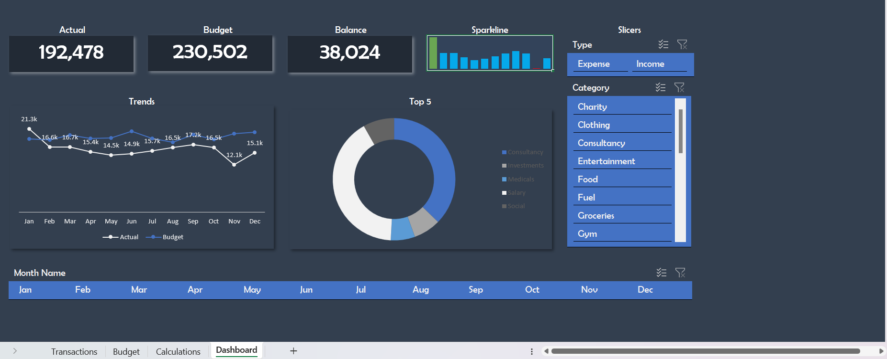

# BUDGET 
## BUDGET - XLS.

### INTRODUCTION
Microsoft Excel is a powerful tool for analysis and one of the most important things is to be able to tell your story through Excel dashboards. This Excel dashboard that presents data on personal financial data comparing budget versus actual. 
### TOOLS OF TRADE 
Tables
Power Query
Power Pivot ( Data Model)
- In Microsoft Excel Analysis, data has to converted into Tables, then cleaned or transformed in Power Query, Power Pivot is where relationships are created among the tables or in other words modelled. The Power Pivot allows for Pivot Tables, Pivot Charts, Slicers and Timelines, CubeFunctions and the Dashboards.
### TABLES
Tables always have to be named properly for easier referencing. The data has to converted to tables and to do that, click within the range of the data to be used, click insert then tables, the range would be highlighted. If formatting has alreday been done for rows and columns you may go ahead and check "my tables has headers". Data would then be converted to a table for easier analysis. After this, remember to name table name appropriately at the table name then save. Example Table1 should be changed to Budget. This can be done for all tables in the model. 
### POWER QUERY
To enable power query, you can find the get data on the Data tab. Since the tables are already in desktop you can click on add query to add, depending on your version. The selected table would be loaded into power query. You may add a new table by adding a new query and one easy way is by copying the M Code of the source in the applied step. The code would contain the name of the initial table queried because the code was copied, then you can replace that with the name of the new table to be queried and it would be loaded automatically. 
With the budget table, the date are pivoted and would need to be unpivoted to be ale to analyza by column. When it is unpivoted, it would be separated into atrributes and values. The attributes can be renamed to Date and changed typed to Date then the value can be renamed to amount. When loading remeber to check the "create only connection".
### POWER PIVOT

### DASHBOARD

